## Description
Utilizing the GPUs for end-to-end data science projects (including ETL and data processing) can drastically decrease computation time.  
  
Because resources are freed up much sooner, multiple iterations of a project (or different projects) can be completes in the same time it would have taken to run one single iteration of a project using the CPU.  

You can find another similar benchmark series here: [CPU vs GPU Benchmarks Series](https://unum.cloud/post/2022-01-25-cpu-vs-gpu/)  

## Results

### Video
* A short 9-minute [video presentation can be found here](https://vimeo.com/706230213).  
    **Please start by watching this.**

### Slides
* A [**PDF** of the slides can be found here](docs/Why_use_GPU_over_CPU.pdf)

### Article
* The [published article can be found here](https://mlops.community/why-use-gpus-instead-of-cpus/)

### Summary
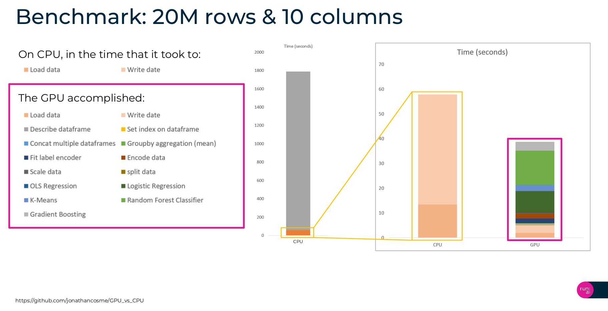
* For **ETL**, we see more than **85% reduction in time**
* For **Machine Learning**, we see a more than **98% reduction in time**
* **End-to-end**, we see a more than **95% reduction in time**    

| | | |
|:-------------------------:|:-------------------------:|:-------------------------:|
||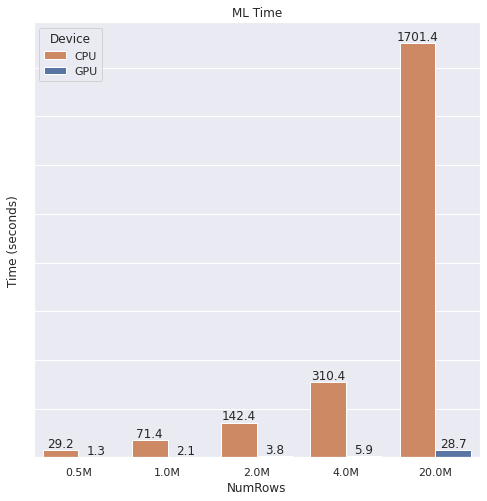||

## Methodology
### The Data
* All datasets had 10 columns
* We tested datasets with 500k rows, 1 million rows, 2 millions rows, 4 millions rows, and 20 million rows   
    (8 million rows was not test, but the dataset is available).
    
### ETL functionality
Each dataset tested went through the following ETL steps:
1. csv file **read**
2. csv file **write**
3. **describe** dataframe
4. **set index** of dataframe for each columns
5. **concatenated** 3 dataframes, each 1/3 the size of the data
6. performed a **groupby aggregation** on each categorical column to find mean.
7. **fit label encoder** on each categorical column
8. **encoded categorical columns**
9. **scaled value columns**
10. **split data** into train, val, and test partitions

### Machine learning models
For each dataset, the following models were fitted after ETL:  
1. OLS Regression
2. Logistic Regression
3. K-Means
4. Random Forest
5. Gradient Boosting

## Files
The dataset used was a **fake dataset** generated by me.   
It is a binary classification problem for detecting counterfeit drugs.  
  
They are available for public download via Google Drive here:
* [sample_data_500k.csv](https://drive.google.com/file/d/1uIUx-3VeJ8jMCJhgaRHs4OGUTmYU0F-x/view?usp=sharing)
* [sample_data_1m.csv](https://drive.google.com/file/d/1e9MWH05VcgEy__liKURkORF3XsGVCEP6/view?usp=sharing)
* [sample_data_2m.csv](https://drive.google.com/file/d/1PKDkJRfxxvNzsbqDkJ1H26t3HGHwQ1X0/view?usp=sharing)
* [sample_data_4m.csv](https://drive.google.com/file/d/1iYnd9h1workv04MO6_cnvr6t1jDNAo_C/view?usp=sharing)
* [sample_data_8m.csv](https://drive.google.com/file/d/1enq-LvU-gf_4dSAFMd2ap9EF1sH9I1Eu/view?usp=sharing)
* [sample_data_20m.csv](https://drive.google.com/file/d/1sFKqsEMUnxttsu4LpogTs1zJ2qqvh1ye/view?usp=sharing)

## Python Packages
The following packages were used for the CPU experiment:
* [numpy](https://numpy.org/)
* [pandas](https://pandas.pydata.org/)
* [scikit-learn](https://scikit-learn.org/stable/)
* [XGBoost](https://xgboost.readthedocs.io/en/stable/)  

The following packages were used for the GPU experiment:
* [cupy](https://cupy.dev/)
* [cuDF](https://docs.rapids.ai/api/cudf/stable/)
* [cuML](https://docs.rapids.ai/api/cuml/stable/)
* [XGBoost](https://xgboost.readthedocs.io/en/stable/)

## Hardware
The experiment was run on a Lenova Legion laptop with the following:
* NVIDIA GeForce RTX Laptop 3080 with 16GB of video memory
* AMD Ryzen 9 5900HX with 8 dual-cores (16 cores) and 32GB of RAM

## Instructions
The following requirements must be met:
* Jupyter Lab
* A conda environment with the [rapids.ai](https://rapids.ai/start.html) suite installed

1. Clone the github repository
2. Download the data files located in the Files section above  

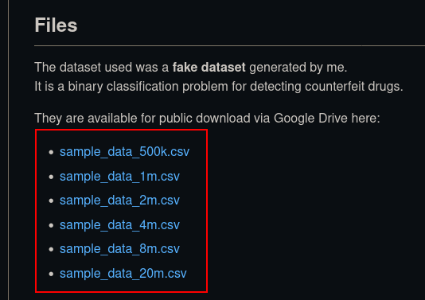  

3. move the downloaded files into the sample_data folder 

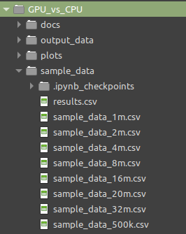

4. Choose any file, and update the filenames in **BOTH** of the following notebooks
* CPU_demo.ipynb
* GPU_demo.ipynb  

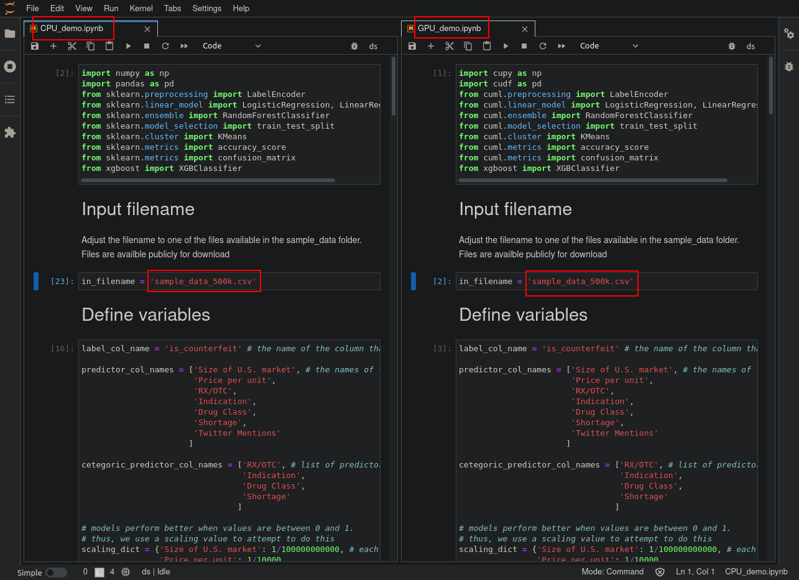  

5. Run both of the notebooks (CPU_demo.ipynb and GPU_demo.ipynb) or...

6. Alternatively, you can run the time_benchmark.ipynb notebook

## Individual Task Figures

### ETL

| | | |
|:-------------------------:|:-------------------------:|:-------------------------:|
|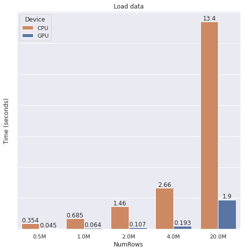| |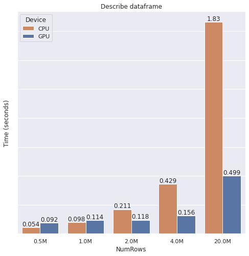|  
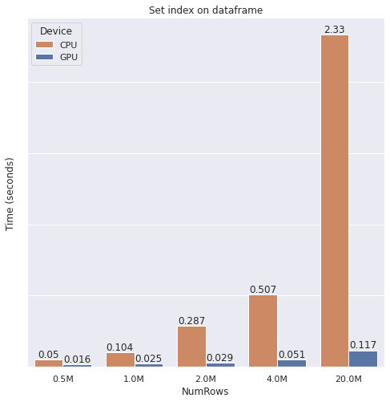|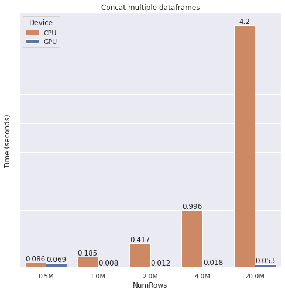|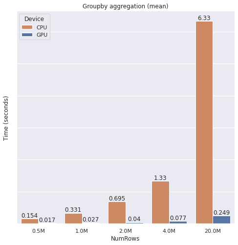|  
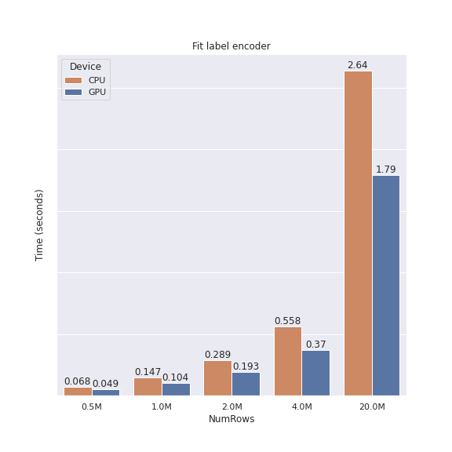|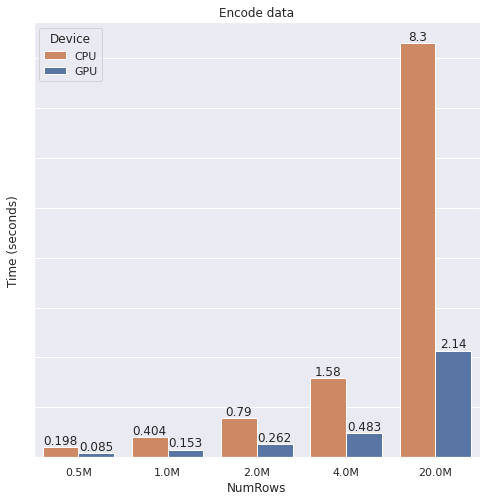|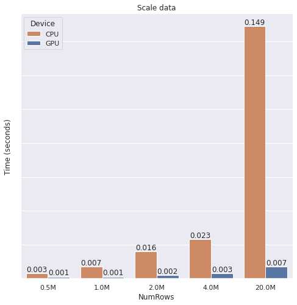|  
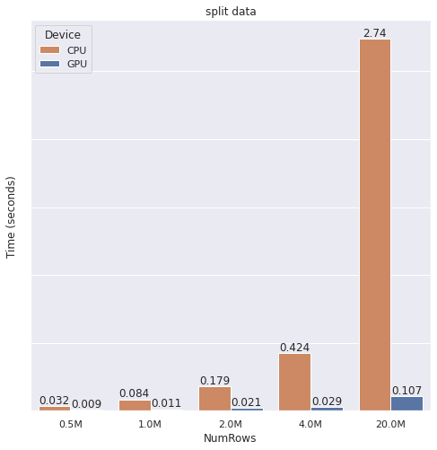|

### Machine Learning

| | | |
|:-------------------------:|:-------------------------:|:-------------------------:|
|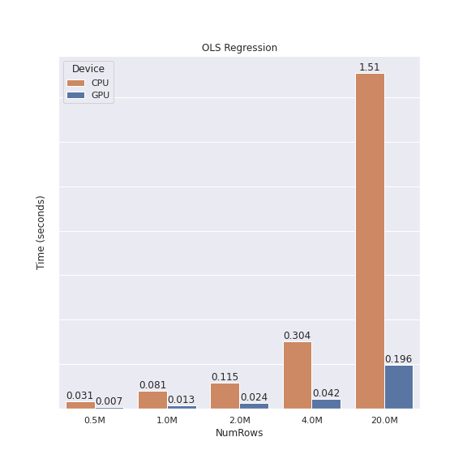|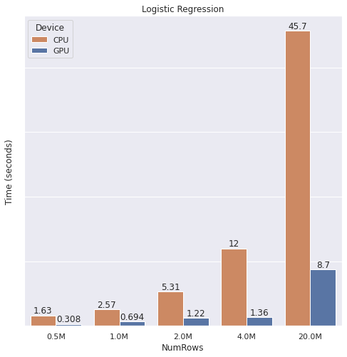|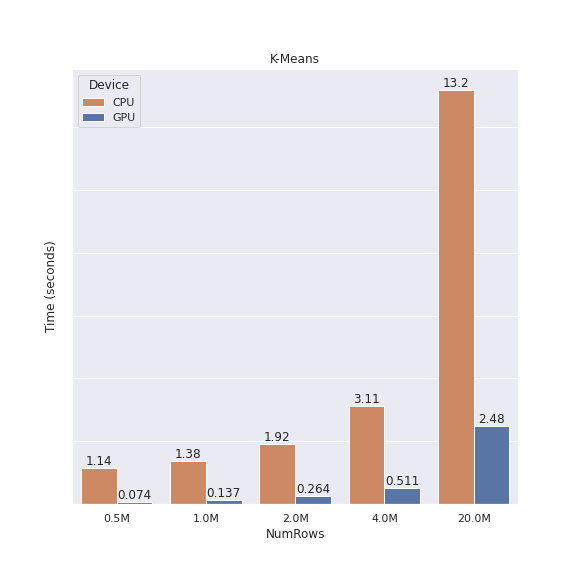|  
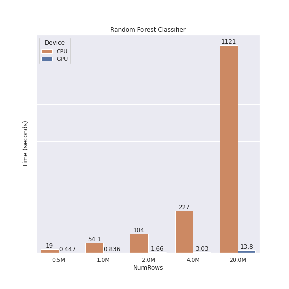|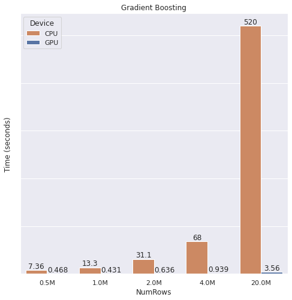|
